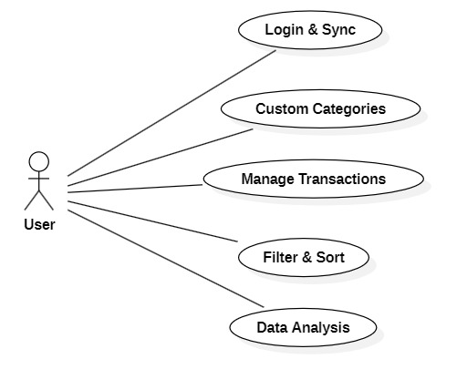
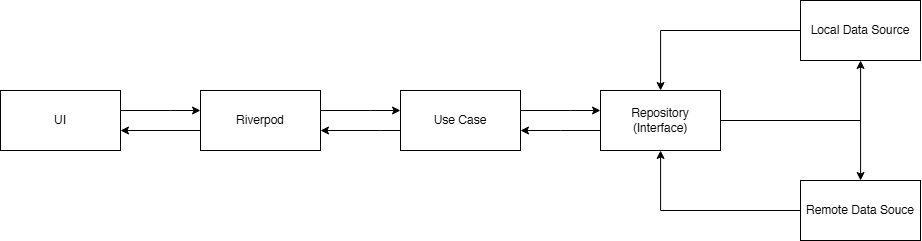
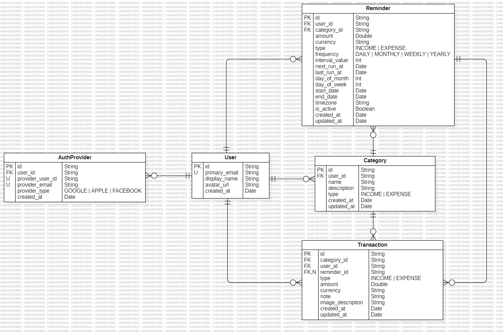

### Money Manage App | Flutter | 03/2026 - Present | IN PROGRESS

#### 1. 🚀 Project Overview
Personal Finance Manager helps users track income and expenses, create custom categories, and sync data across multiple devices. It provides automatic reminders and data analysis features to give insights into financial habits.

#### 2. 🛠 Tech Stack
- **Architecture**: Clean Architecture with Injectable & GetIt.
- **State Management**: Riverpod.
- **Database**: Isar, Hive (Cache), Secure Storage.
- **Networking**: Dio with Interceptors (Retry & Cache logic).
- **Backend**: LoopBack 4, Firebase (Analytics, Crashlytics, Remote Config, FCM).
- **Navigation**: GoRouter.

#### 3. ✨ Use Case Diagram & Features
  

- **Login & Sync**: Log in and sync data across multiple devices. ✅ **Complete**
- **Custom Categories**: Create custom income and expense categories. ✅ **Complete**
- **Manage Transactions**: Record income and expenses. ⏳ **In Progress**
- **Recurring Entries**: Automatically generate daily, weekly, or monthly income/expense records. ⏳ **In Progress**
- **Filter & Sort**: Sort income/expenses by type, date, ... ⏳ **In Progress**
- **Data Analysis**: Analyze financial data for insights. ⏳ **In Progress**

#### 4. 🏛️ Architecture

- **UI**: Displays data and handles user interactions.
- **Riverpod**: Manages app state reactively.
- **Use Case**: Executes business logic and use cases.
- **Repository (Interface)**: Mediates between use case and data sources.
- **Data Sources (Local & Remote)**: Fetches and stores data from local DB or remote API.

#### 5. 🧩 Entity Relationship Diagram

- **User → Category**: A User can create multiple Categories (1 - N).
- **User → AuthProvider**: A User can have multiple authentication providers (e.g., Google, Apple, Facebook) (1 - N).
- **User → Reminder**: A User can set up multiple Reminders for recurring income or expense (1 - N).
- **User → Transaction**: A User can have multiple Transactions (income/expense records) (1 - N).
- **Category → Reminder**: A Category can have multiple Reminders associated with it. (1 - N)
- **Category → Transaction**: A Category can have multiple Transactions. Each transaction must belong to a specific category (income or expense) (1 - N).
- **Reminder → Transaction**: A Reminder can be linked to multiple Transactions, especially for recurring transactions (1 - N).

#### 6. 📂 Folder Structure
```bash
lib/
├── core/                   
│   ├── constants/          # App constants, API endpoints, ...
│   ├── error/              # Failure & Exception classes
│   └── network/            # API Result, Auth Interceptor
│
├── features/               # Business Logic by Features (Feature-first)
│   ├── transaction/        
│   │   ├── data/           # Repositories Impl, Data Sources (Isar/Remote), Models
│   │   ├── domain/         # Repository Interfaces, UseCases
│   │   └── presentation/   # UI (Screens, Widgets), Riverpod Providers
│   ├── category/           
│   └── auth/               
│
├── infrastructure/         # External Services Implementation
│   ├── firebase/           # Remote config, FCM, ...
│   ├── network/            # Dio Service
│   └── social_auth/        # Google, Apple, ... sign in service
│
├── shared/                 # Reusable Components across features
│   ├── widgets/            # Common UI (Custom buttons, Textfields, Style, ...)
│   ├── l10n/               # Localization
│   └── utils/              # Extension methods, formatters
│
├── export/                 # Barrel files (exporting common modules)
├── generated/              # Auto-generated code (Intl)
├── firebase_options.dart   # Firebase configuration
└── main.dart               # Entry point of the application
